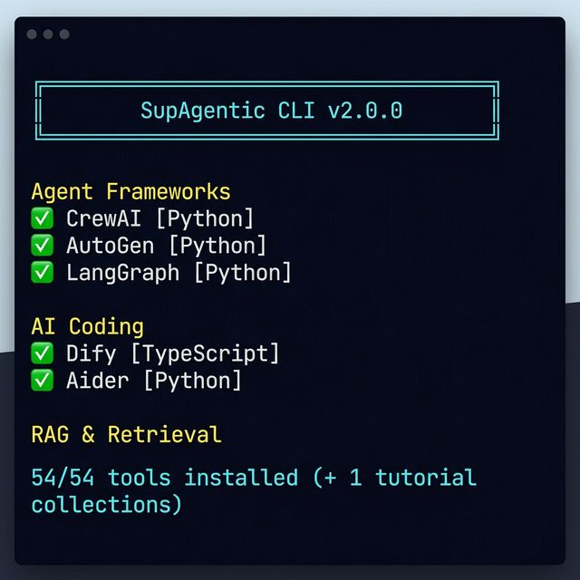

# 🚀 SupAgentic

> A unified collection of **104 powerful open-source AI tools** + **7 curated prompts** — from agent orchestration to swarm simulation to OSINT investigations to voice cloning to model serving.

[](https://alawalmuazu.github.io/SupAgentic)
[](.)
[](.)
[](prompts/)
[](https://pypi.org/project/supagentic/)

<p align="center">
  
</p>

---

## 📦 Tools by Category

### 🤖 Agent Frameworks
| # | Tool | Directory | Description |
|---|------|-----------|-------------|
| 1 | **The Agency** | `tools/agency-agents/` | Personality-driven AI agent collection |
| 2 | **CrewAI** | `tools/crewai/` | Role-based multi-agent orchestration (44k ⭐) |
| 3 | **AutoGen** | `tools/autogen/` | Microsoft's multi-agent conversation framework (54k ⭐) |
| 4 | **LangGraph** | `tools/langgraph/` | Stateful agent workflows with graph execution |
| 5 | **Dify** | `tools/dify/` | Visual AI app builder with built-in RAG (129k ⭐) |
| 6 | **Langflow** | `tools/langflow/` | Visual drag-and-drop agent & RAG builder (140k ⭐) |
| 7 | **MetaGPT** | `tools/metagpt/` | Multi-agent software company — PM, Architect, Engineer (62k ⭐) |
| 8 | **AutoGPT** | `tools/autogpt/` | The OG autonomous agent platform (175k ⭐) |
| 9 | **LangChain** | `tools/langchain/` | Foundational LLM framework — chains, agents, tools (123k ⭐) |
| 10 | **Chainlit** | `tools/chainlit/` | Build production-ready conversational AI chat UIs (8k ⭐) |
| 11 | **Phidata** | `tools/phidata/` | Multi-modal agents with memory, knowledge, and reasoning (20k ⭐) |

### 🛡️ LLM Security
| # | Tool | Directory | Description |
|---|------|-----------|-------------|
| 7 | **Promptfoo** | `tools/promptfoo/` | LLM evaluation & red-teaming CLI |

### 💻 AI Coding Assistants
| # | Tool | Directory | Description |
|---|------|-----------|-------------|
| 8 | **Impeccable** | `tools/impeccable/` | Claude design skill to fight "AI slop" |
| 9 | **Aider** | `tools/aider/` | Terminal AI pair programmer with Git integration |
| 10 | **Open Interpreter** | `tools/open-interpreter/` | Let LLMs run code locally |
| 11 | **Fabric** | `tools/fabric/` | 100+ curated AI prompt patterns |
| 12 | **Tabby** | `tools/tabby/` | Self-hosted GitHub Copilot replacement |
| 13 | **Claude Engineer** | `tools/claude-engineer/` | Autonomous coding agent for Claude |
| 14 | **Gemini CLI** | `tools/gemini-cli/` | Google's Gemini multimodal model in your terminal (87k ⭐) |
| 15 | **Claude Code** | `tools/claude-code/` | Anthropic's privacy-first on-device coding assistant (46k ⭐) |
| 16 | **Cursor Rules** | `tools/cursor-rules/` | Community-curated .cursorrules library for AI IDEs (10k ⭐) |
| 17 | **SWE-Agent** | `tools/swe-agent/` | Princeton's autonomous software engineer (18k ⭐) |
| 18 | **Bolt.new** | `tools/bolt-new/` | AI full-stack web app builder by StackBlitz (28k ⭐) |

### 📚 RAG & Retrieval
| # | Tool | Directory | Description |
|---|------|-----------|-------------|
| 14 | **LlamaIndex** | `tools/llama-index/` | Data framework for LLM applications |
| 15 | **RAGFlow** | `tools/ragflow/` | End-to-end production RAG engine |
| 16 | **Anything-LLM** | `tools/anything-llm/` | All-in-one RAG desktop app |
| 19 | **Haystack** | `tools/haystack/` | Deepset's production-ready RAG & NLP pipeline framework (42k ⭐) |

### 🧠 Context & Memory
| # | Tool | Directory | Description |
|---|------|-----------|-------------|
| 17 | **OpenViking** | `tools/openviking/` | Context database with `viking://` protocol |
| 20 | **Mem0** | `tools/mem0/` | Self-improving memory layer for personalized AI (25k ⭐) |

### 🐟 Swarm Intelligence
| # | Tool | Directory | Description |
|---|------|-----------|-------------|
| 18 | **MiroFish** | `tools/mirofish/` | Prediction engine using knowledge graphs & swarm agents |
| 19 | **OASIS** | `tools/oasis/` | Social simulation engine — scales to 1M agents (CAMEL-AI) |
| 20 | **Swarms** | `tools/swarms/` | Enterprise multi-agent swarm orchestration framework |

### 🎭 Simulation
| # | Tool | Directory | Description |
|---|------|-----------|-------------|
| 21 | **Generative Agents** | `tools/generative-agents/` | Stanford Smallville — believable AI agent society (18k ⭐) |
| 22 | **AgentVerse** | `tools/agentverse/` | Multi-agent simulation platform (OpenBMB) |
| 23 | **TwinMarket** | `tools/twinmarket/` | Financial market simulation with LLM agents (NeurIPS 2025) |

### 🏠 Local LLM Inference
| # | Tool | Directory | Description |
|---|------|-----------|-------------|
| 24 | **Ollama** | `tools/ollama/` | Run LLMs locally with one command |
| 25 | **Open WebUI** | `tools/open-webui/` | Self-hosted ChatGPT-style UI for Ollama & OpenAI APIs (80k ⭐) |
| 26 | **DeepSeek-V3** | `tools/deepseek/` | GPT-4-class open model, 671B MoE architecture (100k ⭐) |

### 🔧 Fine-Tuning & Training
| # | Tool | Directory | Description |
|---|------|-----------|-------------|
| 25 | **Unsloth** | `tools/unsloth/` | 2-5x faster fine-tuning, 70% less VRAM |
| 26 | **NanoChat** | `tools/nanochat/` | Karpathy's minimal LLM-from-scratch framework |
| 27 | **LLaMA-Factory** | `tools/llama-factory/` | All-in-one fine-tuning with web GUI |

### ⚡ Model Modification
| # | Tool | Directory | Description |
|---|------|-----------|-------------|
| 28 | **Heretic** | `tools/heretic/` | Automated abliteration for local LLMs |

### 🎨 Image & Media Generation
| # | Tool | Directory | Description |
|---|------|-----------|-------------|
| 29 | **ComfyUI** | `tools/comfyui/` | Node-based AI image/video/3D generation |
| 30 | **Kokoro TTS** | `tools/kokoro-tts/` | 82M param multilingual text-to-speech |
| 31 | **Fish Speech** | `tools/fish-speech/` | Ultra-realistic voice cloning from 10-30s audio (26k ⭐) |

### 🦀 Automation & Browser
| # | Tool | Directory | Description |
|---|------|-----------|-------------|
| 32 | **OpenClaw** | `tools/openclaw/` | Personal AI assistant — runs locally, browses web, writes own skills (250k ⭐) |
| 33 | **Browser-Use** | `tools/browser-use/` | Make websites accessible for AI agents — browser automation |
| 34 | **n8n** | `tools/n8n/` | Workflow automation with AI, 400+ integrations (160k ⭐) |

### 📊 Data & Analytics
| # | Tool | Directory | Description |
|---|------|-----------|-------------|
| 35 | **PandasAI** | `tools/pandas-ai/` | Chat with databases/DataFrames in natural language (15k ⭐) |
| 36 | **Dataherald** | `tools/dataherald/` | Enterprise NL-to-SQL engine |

### 🔒 Security & Pentesting
| # | Tool | Directory | Description |
|---|------|-----------|-------------|
| 37 | **Nuclei** | `tools/nuclei/` | Template-based vulnerability scanner (23k ⭐) |
| 38 | **Caido** | `tools/caido/` | Lightweight Burp Suite alternative |

### 🚀 Model Serving
| # | Tool | Directory | Description |
|---|------|-----------|-------------|
| 34 | **vLLM** | `tools/vllm/` | High-throughput LLM inference engine — PagedAttention, continuous batching |

### 🧪 Tutorials & Collections
| # | Tool | Directory | Description |
|---|------|-----------|-------------|
| 35 | **AI Engineering Hub** | `tools/ai-engineering-hub/` | 100+ hands-on AI tutorials |
| — | **AI Project Gallery** | `tools/ai-project-gallery/` | ML, Deep Learning & GenAI projects |
| — | **500 AI/ML Projects** | `tools/500-ai-ml-projects/` | 500+ real-world projects with code |
| — | **E2E GenAI Projects** | `tools/end-to-end-genai-projects/` | Production GenAI with LLMs, RAG, agents |
| — | **GenAI Projects** | `tools/genai-projects/` | GenAI portfolio: images, code, text |
| — | **100 AI/ML Projects** | `tools/100-ai-ml-projects/` | 100 curated CNN/RNN/GAN/CV/NLP projects |
| — | **Awesome Deep Learning** | `tools/awesome-deep-learning/` | 23k⭐ DL tutorials, projects & books |
| — | **Awesome ML** | `tools/awesome-machine-learning/` | 66k⭐ Definitive ML frameworks list |
| — | **Awesome Project Ideas** | `tools/awesome-project-ideas/` | ML/NLP/CV project ideas for portfolios |
| — | **Awesome GenAI Guide** | `tools/awesome-genai-guide/` | Comprehensive GenAI resource hub |

---

## 🖥️ CLI Reference

SupAgentic includes a full-featured command-line interface with **18 commands**:

```bash
python supagentic.py <command> [args]
```

| Command | Description | Example |
|---------|-------------|---------|
| `list` | List all 104 tools by category | `supagentic list` |
| `search <query>` | Search by name/category/language | `supagentic search swarm` |
| `info <tool>` | Show tool details, repo, & README | `supagentic info mirofish` |
| `health` | Check repo freshness (days since commit) | `supagentic health` |
| `update [tool]` | Git pull one or all tools | `supagentic update` |
| `clone <tool>` | Install a tool on-demand from GitHub | `supagentic clone mirofish` |
| `run <tool>` | Start a tool (auto-detect npm/python/docker) | `supagentic run langflow` |
| `setup <tool>` | Auto-install tool dependencies | `supagentic setup langflow` |
| `stats [query]` | Live GitHub stars/forks/issues via API | `supagentic stats agents` |
| `create <args>` | Scaffold a new tool entry | `supagentic create MyTool user/repo Agents Python` |
| `deps [tool]` | Show dependency map with ports | `supagentic deps` |
| `pipeline [name]` | Show/run orchestration pipelines | `supagentic pipeline` |
| `tui` | Interactive tool browser (rich tables) | `supagentic tui` |
| `mcp [--json]` | MCP manifest / JSON export | `supagentic mcp --json` |
| `mcp-serve` | Launch MCP server (stdio or `--sse`) | `supagentic mcp-serve --sse` |
| `mcp-register` | Auto-register with Claude Desktop / Cursor | `supagentic mcp-register` |
| `serve [port]` | Start dashboard HTTP server | `supagentic serve 8899` |
| `open <tool>` | Open tool directory in file manager | `supagentic open aider` |

---

## 🔗 Orchestration Pipelines

Chain tools together for end-to-end workflows:

### `scrape-predict-narrate`
> Scrape web → Simulate prediction → Voice narrate the report

1. **Browser-Use** → Scrape target URL and extract data
2. **MiroFish** → Build knowledge graph → Run multi-agent simulation → Generate report
3. **Fish Speech** → Convert report to natural speech audio

### `train-serve-deploy`
> Fine-tune model → Serve with vLLM → Connect to agents

1. **Unsloth** → Fine-tune base model with LoRA/QLoRA
2. **vLLM** → Deploy model with OpenAI-compatible API
3. **Langflow** → Build agent workflow using served model

### `research-simulate-report`
> RAG retrieval → Agent simulation → Automated analysis

1. **RAGFlow** → Ingest documents and build RAG pipeline
2. **AgentVerse** → Run multi-agent debate/analysis on findings
3. **MiroFish** → Generate comprehensive prediction report

---

## 🗺️ Dependency Map

Tools with known startup commands, ports, and dependencies:

| Tool | Start Command | Port(s) | Depends On |
|------|--------------|---------|------------|
| MiroFish | `npm run dev` | 3000, 5001 | OASIS |
| OASIS | `python -m oasis` | — | — |
| Langflow | `python -m langflow run` | 7860 | — |
| OpenClaw | `npm run dev` | 3000 | Ollama |
| Fish Speech | `python tools/webui/app.py` | 7862 | — |
| vLLM | `python -m vllm.entrypoints.openai.api_server` | 8000 | — |
| Ollama | `ollama serve` | 11434 | — |
| ComfyUI | `python main.py` | 8188 | — |
| RAGFlow | `docker compose up -d` | 9380 | — |
| Dify | `docker compose up -d` | 3000 | — |

---

## 🐋 Docker Compose

Spin up multiple tools together with the local stack:

```bash
# Start core services (Ollama, RAGFlow, Langflow, Dashboard)
docker compose -f docker-compose.local-stack.yml up -d

# Start GPU-accelerated services (vLLM, ComfyUI)
docker compose -f docker-compose.local-stack.yml --profile gpu up -d
```

Services included: Ollama, vLLM, RAGFlow, Dify, Langflow, ComfyUI, Dashboard

---

## 🔌 MCP Server

Full [Model Context Protocol](https://modelcontextprotocol.io/) server — any AI agent can discover and use all 104 tools:

```bash
# stdio mode (for Claude Desktop, Cursor, Trae, Codex)
python mcp_server.py

# HTTP/SSE mode (for remote/web access)
python mcp_server.py --sse --port 8765

# Auto-register with Claude Desktop + Cursor
python supagentic.py mcp-register

# Health check
python mcp_server.py --health
```

### Capabilities
| Feature | Count | Details |
|---------|-------|---------|
| **tools/call** | 104+ | All tools + search + pipeline — with real action execution |
| **resources** | 14 | README, INTEGRATIONS, CHANGELOG, 7 prompts, 3 pipelines |
| **prompts** | 7 | Prompt templates with argument substitution |

### Connect from Claude Desktop
```json
{
  "mcpServers": {
    "supagentic": {
      "command": "python",
      "args": ["path/to/SupAgentic/mcp_server.py"]
    }
  }
}
```

Pre-configured for: **Claude Desktop**, **Cursor**, **Trae**, **Antigravity/Gemini**, **Codex**

---

## 💬 Prompt Library (7 Prompts)

| Prompt | File | Purpose |
|--------|------|---------|
| Claude Deck Builder | `prompts/Claude prompt.txt` | Auto-generate pitch decks via Gamma |
| System Prompt Extractor | `prompts/system-prompt-extractor.txt` | Educational prompt injection research |
| Full-Stack App Generator | `prompts/fullstack-app-generator.txt` | Scaffold complete apps in one shot |
| Code Review Expert | `prompts/code-review-expert.txt` | Structured security/perf/bug review |
| Chain-of-Thought | `prompts/chain-of-thought.txt` | Force structured reasoning |
| Data Analysis | `prompts/data-analysis.txt` | Comprehensive dataset analysis |
| Resume Generator | `prompts/resume-generator.txt` | ATS-optimized resume/CV builder |

---

## ⚡ Quick Start

```bash
# Clone the toolkit
git clone https://github.com/alawalmuazu/SupAgentic.git
cd SupAgentic

# List all tools
python supagentic.py list

# Install a single tool on-demand
python supagentic.py clone mirofish

# Install dependencies & start
python supagentic.py setup mirofish
python supagentic.py run mirofish

# Live GitHub stats
python supagentic.py stats

# Interactive browser
python supagentic.py tui

# Connect to AI agents via MCP
python supagentic.py mcp-register

# Launch the dashboard
python supagentic.py serve

# Spin up Docker stack
docker compose -f docker-compose.local-stack.yml up -d

# Install as a system command
pip install -e .
supagentic list
```

---

## 📚 More

- **[Dashboard](https://alawalmuazu.github.io/SupAgentic)** — Live dashboard with search & filters
- **[CHANGELOG.md](CHANGELOG.md)** — Version history & release notes
- **[INTEGRATIONS.md](INTEGRATIONS.md)** — 5 recipes for combining tools
- **[CONTRIBUTING.md](CONTRIBUTING.md)** — How to suggest & add tools
- **[supagentic.py](supagentic.py)** — CLI (18 commands)
- **[mcp_server.py](mcp_server.py)** — Full MCP server (stdio + SSE)
- **[pyproject.toml](pyproject.toml)** — PyPI package config
- **[docker-compose.local-stack.yml](docker-compose.local-stack.yml)** — Multi-tool Docker stack

---

## 📄 License

Each tool retains its original license. See `tools/<name>/LICENSE`.
