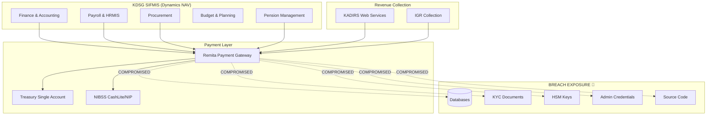

# 🏛️ KDSG SIFMIS IMPACT ASSESSMENT
## Remita Breach — Implications for Kaduna State Financial Infrastructure
**Classification:** CONFIDENTIAL  
**Date:** April 4, 2026  
**Reference:** KDSG-SIFMIS-IMPACT-2026-04  
**Prepared For:** KDSG Ministry of Finance, Head of Service, Planning & Budget Commission

---

## Executive Summary

The Remita data breach has **direct and critical implications** for the Kaduna State Government's financial operations. KDSG's SIFMIS (State Integrated Financial Management Information System), built on **Microsoft Dynamics NAV** and implemented by PwC, relies on Remita as a core payment gateway for revenue collection, salary disbursement, and vendor payments across all MDAs. This assessment maps the breach impact to KDSG's specific infrastructure.

> [!CAUTION]
> **If government HSM keys in the dump belong to or are shared with KDSG's payment signing infrastructure, the state's entire Treasury Single Account (TSA) payment authorization chain is compromised.**

---

## 1. KDSG-Remita Integration Map

---

## 2. Impact by SIFMIS Module

### 2.1 Finance & Accounting Module
| Risk | Severity | Detail |
|---|---|---|
| Payment authorization bypass | 🔴 Critical | If HSM keys used for KDSG payment signing are in the dump, fraudulent payments could be authorized |
| Revenue reconciliation tampering | 🔴 Critical | Interbanking data exposure reveals settlement logic exploitable for revenue diversion |
| Audit trail integrity | 🟡 High | Source code access enables understanding of audit log bypass techniques |

### 2.2 Payroll & HRMIS Module
| Risk | Severity | Detail |
|---|---|---|
| Employee PII exposure | 🔴 Critical | All civil servants paid via Remita may have BVN, bank details, and personal records exposed |
| Ghost worker injection | 🟡 High | Admin credentials + database structure knowledge enables phantom payroll entries |
| Salary diversion | 🔴 Critical | Bank account routing data in interbanking tables could be manipulated |

### 2.3 Procurement Module
| Risk | Severity | Detail |
|---|---|---|
| Vendor payment fraud | 🔴 Critical | Business owner database exposes vendor registration data and payment channels |
| Contract award intelligence | 🟡 High | Historical payment patterns reveal procurement intelligence |
| Double-payment exploitation | 🟡 High | Database restore capability enables transaction replay attacks |

### 2.4 Budget & Planning Module
| Risk | Severity | Detail |
|---|---|---|
| Budget allocation intelligence | 🟠 Medium | Payment volumes reveal actual vs. budgeted expenditure |
| Release mechanism compromise | 🟡 High | Understanding of double-release controls from source code |

### 2.5 Pension Management Module
| Risk | Severity | Detail |
|---|---|---|
| Pensioner identity theft | 🔴 Critical | KYC documents of retired civil servants fully exposed |
| Pension payment diversion | 🔴 Critical | Account routing details in interbanking tables |

---

## 3. Affected KDSG Stakeholders

| Stakeholder | Exposure Type | Estimated Impact |
|---|---|---|
| **Ministry of Finance** | TSA payment authorization, revenue reconciliation | Direct — payment infrastructure |
| **Head of Service** | Employee payroll data, biometrics | Direct — all civil servant PII |
| **Civil Service Commission** | HR records linked to payment system | Direct — employment records |
| **Planning & Budget Commission** | Budget release and control mechanisms | Indirect — process intelligence |
| **KADIRS** | Revenue collection routing, taxpayer data | Direct — IGR collection chain |
| **All 23 LGAs** | Local revenue collection through Remita | Direct — LGA payment channels |
| **All MDAs** | Vendor payments, staff salaries | Direct — operational payments |
| **PayKaduna** | State payment sub-platform integration | Potential — depends on Remita API coupling |

---

## 4. Critical Risk Scenarios for KDSG

### Scenario A: TSA Payment Forgery
- **Prerequisite:** HSM keys in the dump are valid for KDSG transactions
- **Attack:** Forge payment authorizations to divert TSA funds
- **Impact:** Millions of Naira in fraudulent disbursements
- **Likelihood:** 🟡 Medium (keys may be rotated, but verification needed)

### Scenario B: Mass Civil Servant Identity Theft
- **Prerequisite:** KDSG employee KYC data is in the 800GB+ dump
- **Attack:** Open fraudulent bank accounts, apply for loans using stolen identities
- **Impact:** Thousands of state employees affected
- **Likelihood:** 🔴 High (Remita processes all KDSG salaries)

### Scenario C: Ghost Worker Injection via Admin Access
- **Prerequisite:** Admin credentials are valid or password hashes crackable
- **Attack:** Create phantom employees in payroll pipeline
- **Impact:** Ongoing salary fraud until detection
- **Likelihood:** 🟡 Medium (depends on credential rotation status)

### Scenario D: Revenue Diversion via KADIRS Integration
- **Prerequisite:** KADIRS-Remita API credentials in the secrets dump
- **Attack:** Redirect IGR collections to attacker-controlled accounts
- **Impact:** State revenue loss
- **Likelihood:** 🟡 Medium (API key rotation status unknown)

---

## 5. Immediate Actions Required by KDSG

### 🔴 Critical (0-24 Hours)
1. **Contact SystemSpecs/Remita** — Request confirmation of KDSG-specific data exposure
2. **Suspend automated Remita API integrations** — Switch to manual payment verification temporarily
3. **Rotate all KDSG-Remita API keys** — Every integration credential between SIFMIS and Remita
4. **Audit TSA transaction logs** — Review last 90 days for anomalous payments
5. **Alert KADIRS** — Suspend or monitor web service revenue integration

### 🟡 High Priority (24-72 Hours)
6. **Commission BVN verification audit** — Cross-reference employee bank details against known-good records
7. **Enable MFA on all Dynamics NAV administrative accounts** — If not already enforced
8. **Review PayKaduna integration** — Assess if payment sub-platform shares Remita credentials
9. **Brief the Governor/SSG** — Executive notification of state-level financial system risk

### 🟠 Medium Priority (1-2 Weeks)
10. **Engage PwC for emergency security assessment** — Leverage existing SIFMIS implementation relationship
11. **Conduct employee data subject notification** — Per NDPA 2023 obligations
12. **Request CBN guidance** — On state-level TSA security posture
13. **Evaluate Dynamics NAV network segmentation** — Ensure NAV servers are not exposed via compromised Remita pathways

---

## 6. Long-Term Recommendations

1. **Implement payment signing redundancy** — Don't rely solely on Remita's HSM; add state-level countersigning
2. **Deploy transaction anomaly detection** — ML-based monitoring on SIFMIS payment flows
3. **Establish state CERT capability** — Dedicated cybersecurity incident response for KDSG digital infrastructure
4. **Diversify payment gateway dependencies** — Reduce single-point-of-failure on Remita
5. **Mandatory periodic credential rotation** — Automated key rotation for all inter-system APIs

---

*This assessment is based on publicly available breach intelligence and KDSG SIFMIS architectural documentation. Actual exposure must be confirmed through direct forensic analysis by SystemSpecs and KDSG IT.*
