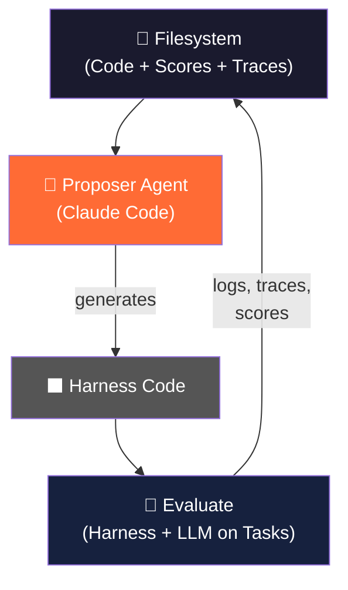
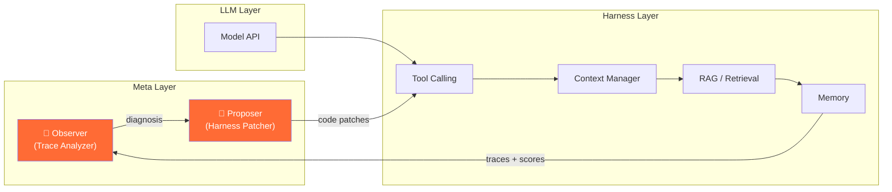

# Meta-Harness: Deep Dive & Self-Optimizing Harness Blueprint

> **Paper:** [Meta-Harness: End-to-End Optimization of Model Harnesses](https://arxiv.org/abs/2603.28052)
> **Authors:** Yoonho Lee, Roshen Nair, Qizheng Zhang (Stanford), Kangwook Lee (KRAFTON), Omar Khattab (MIT), Chelsea Finn (Stanford)
> **Repo:** [stanford-iris-lab/meta-harness-tbench2-artifact](file:///c:/Users/OMEN/Documents/SupAgentic/meta-harness-tbench2-artifact)

---

## 1. Core Thesis

> **The harness — not the model — is the primary bottleneck in LLM system performance.**

A "harness" is the code that decides: what to store, what to retrieve, what to pass to the model, and what to throw away. The same model (e.g., Claude Haiku 3.5) can show a **6× performance gap** depending on harness quality.

## 2. The Meta-Harness Architecture

### The Loop
| Step | What Happens |
|------|-------------|
| **1. Propose** | Proposer agent reads the full filesystem (source code, all prior scores, raw execution traces) via `grep`, `cat`, etc. — up to **10M tokens** of context per step |
| **2. Evaluate** | New harness runs against task suite, producing pass/fail scores + full execution traces |
| **3. Store** | All code, scores, and traces are written back to the filesystem |
| **Repeat** | Proposer reads failure traces, performs **counterfactual diagnosis**, proposes targeted fixes |

### Why 10M Tokens Matters
Prior methods (OpenEvolve, TTT-Discover, PUCT) compress feedback into **≤26K tokens** — short summaries, scalar scores, or sliding windows. Meta-Harness gives the proposer the *raw* execution trace, so it can trace a failure to the **specific harness decision** that caused it.

## 3. Results

| Benchmark | Result | Notes |
|-----------|--------|-------|
| **TerminalBench-2** | **76.4%** (Opus 4.6) | #2 overall, **#1 among all Haiku 4.5 agents** |
| **Text Classification** | +7.7 pts over SOTA | Using 4× fewer context tokens |
| **Math Reasoning (IMO)** | +4.7 pts avg | Single harness transfers across 5 unseen models |
| **Harness Search** | 10× fewer evaluations | Matches OpenEvolve/PUCT final accuracy in 1/10th the budget |

## 4. The Actual Harness Code (Reverse-Engineered)

The released artifact ([agent.py](file:///c:/Users/OMEN/Documents/SupAgentic/meta-harness-tbench2-artifact/agent.py) — 1,322 lines) reveals exact harness techniques the automated search discovered:

### 4a. Environment Bootstrapping (Lines 873-969)
Before the agent loop starts, a single compound shell command gathers:
- Working directory, file listing
- Available languages (Python, GCC, Node, Java, Rust, Go)
- Package managers (pip, apt-get)
- Memory info

This **eliminates 2-5 early exploration turns** the agent would normally waste on `ls`, `which python3`, etc.

### 4b. Marker-Based Command Polling (Lines 237-289)
Instead of waiting the full `duration_sec` for every command:
1. An echo marker (`__CMDEND__N__`) is sent after each command
2. The harness polls for the marker in 0.5s intervals
3. If found early → **move on immediately**, saving cumulative seconds

### 4c. Native Tool Calling (Lines 142-215)
Three tools defined as structured function calls:
- `execute_commands` — with `analysis`, `plan`, and `commands` fields
- `task_complete` — binary completion signal
- `image_read` — multimodal file analysis via base64

> [!IMPORTANT]
> The `analysis` + `plan` fields in `execute_commands` **force the model to think before acting** — a form of structured chain-of-thought built into the tool schema itself.

### 4d. Double-Confirmation Completion (Lines 317-332)
Task completion requires **two consecutive `task_complete` calls**. On the first call, the harness presents a verification checklist:
- Does the solution meet requirements?
- Does it account for variable values?
- Has it been verified from test engineer, QA, and user perspectives?

### 4e. Prompt Template (12 lines)
The [terminus-kira.txt](file:///c:/Users/OMEN/Documents/SupAgentic/meta-harness-tbench2-artifact/prompt-templates/terminus-kira.txt) is remarkably minimal — it simply sets the Linux task context and injects `{instruction}` + `{terminal_state}`. The **real intelligence is entirely in the harness code**.

## 5. Self-Optimizing Harness Prototype for SupAgentic

### Architecture

### Implementation Plan

| Component | Purpose | Inspired By |
|-----------|---------|-------------|
| **Trace Logger** | Captures every tool call, context window state, retrieval result, and score | Meta-Harness filesystem approach |
| **Failure Detector** | Identifies wrong tool calls, lost context, bad retrieval, task failures | Counterfactual diagnosis from paper |
| **Harness Patcher** | LLM agent that reads traces and generates targeted code fixes | The proposer agent |
| **Evaluation Runner** | Runs patched harness against task suite, scores results | The evaluation loop |
| **Version Store** | Git-based storage of all harness versions with scores | Filesystem-based history |

### Key Design Decisions

> [!TIP]
> **Start small.** The paper shows that even 4 evaluation iterations can match prior art. You don't need a massive compute budget — you need **rich trace data**.

1. **Trace everything** — Don't compress feedback. Store raw execution logs.
2. **Use the filesystem** — Give the proposer `grep`/`cat` access, not summarized prompts.
3. **Structured tool schemas** — Force `analysis` + `plan` before `commands` (as Meta-Harness does).
4. **Double-confirm completions** — Prevent premature task marking.
5. **Environment bootstrapping** — Pre-gather system state before agent loop starts.

## 6. Key Takeaway

> The model is becoming a commodity. **The harness is the moat.**
> Teams that automate harness optimization will outperform manual engineering every time — and the gap will only widen as models become more capable but harness complexity grows.
