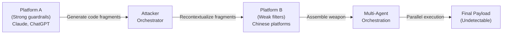

# The Hidden Architecture of AI Platforms — Intelligence Brief

> **Researcher**: Ivan Barbato (~30 years in critical infrastructure security)
> **Scope**: 6 months, 200+ experiments, 7 AI platforms
> **Repo**: [analise2024/The-Hidden-Architecture-of-AI-Platforms](https://github.com/analise2024/The-Hidden-Architecture-of-AI-Platforms)
> **Source**: Video interview (Yanivman) + 3 published PDFs

---

## TL;DR

A veteran security researcher spent 6 months forensically analyzing 7 major AI platforms (ChatGPT, Claude, DeepSeek, Manus, Gemini, and others). He documented that **the gap between what platforms market and what they architect is not incidental — it's by design**. Key findings cover local resource exploitation, backdoor browser extensions, cross-platform weaponization, behavioral biometric collection, and privacy policy dark patterns.

---

## Finding 1: Local Resource Exploitation

> *"That's not a glitch. That's not a bug. That's an architecture."*

| Metric | Observed |
|--------|----------|
| CPU Usage | 99.8% sustained on single core |
| Temperature | 75–80°C (thermal throttling territory) |
| Claude GitHub Issues | 18+ open issues on CPU/memory/thermal |
| Battery Impact | Catastrophic drain during idle AI sessions |
| Hardware Lifecycle | Accelerated degradation from sustained thermal stress |

### Why It Happens
- **Profit**: Offloading compute to user hardware reduces cloud costs
- **Security**: Server-side processing exposes the platform to abuse

### The Mobile Contradiction
Mobile apps **offload processing to the server** — they don't have this problem. Desktop/web versions *could* do the same but **choose not to**. This is a design decision, not a technical limitation.

---

## Finding 2: Manus Browser Extension (RAT Characteristics)

| Event | Detail |
|-------|--------|
| Launch | March 2025 (Singapore) |
| Installs in 7 days | 40,000 |
| Revenue (8 months later) | $125M ARR |
| Meta acquisition | $2.5B (Dec 30, 2025) |
| MineGuard risk score | **100/100** (maximum) |

### What MineGuard Found
The browser extension had:
- Debugger API access
- Cookie access across **all domains**
- Access to every authenticated session
- Persistent connection to Manus servers
- Credential exfiltration capability from any logged-in site

> **Assessment**: Functionally identical to a **Remote Access Trojan (RAT)**

### Meta's Response
MineGuard published December 1, 2025. Meta closed the $2.5B acquisition **29 days later**. When asked about the report, Meta responded:

> *"Security is fundamental to everything we do."*

No independent audit was confirmed.

### Barbato's Additional Finding — Proxied API Calls
Using prompt engineering + social engineering, Barbato discovered Manus routes prompts through **proxied API calls** branded as "OpenAI" but actually masking which model generates the output. Users have **zero visibility** into which model produces their response — critical for enterprise accuracy requirements.

---

## Finding 3: Zombie Agent (Zero-Click ChatGPT Attack)

> **Discovered by**: Vikabo (Radwell), September 2025
> **Patched**: 80+ days after disclosure

### Attack Chain
```
Step 1: Attacker sends email with hidden prompt injection (white text)
        ↓ (invisible to user)
Step 2: User asks ChatGPT to "summarize my inbox"
        → ChatGPT reads hidden instruction, executes it
        ↓ (zero clicks required)
Step 3: Data exfiltration via index pages per letter
        → BIN tracking links bypass OpenAI URL safety filters
        → Data sent letter-by-letter to attacker server
        ↓
Step 4: Attack writes itself into ChatGPT MEMORY
        → Every future conversation leaks data
        → Deleting conversations doesn't help
        → Only fix: manually clear ChatGPT memory
```

### Additional ChatGPT Vulnerabilities (Tenable, Nov 2025)
7 documented vulnerabilities, several only partially patched:

1. Conversation injection
2. Memory injection
3. BIN tracking link bypass
4. Zero-click attacks
5. Markdown rendering exploit
6. Web tools abuse
7. Safety feature bypasses

---

## Finding 4: Claude — State-Sponsored Autonomous Attack

### Vulnerability 1: Files API Exploit (Oct 2025)
- Victim uploads document with hidden prompt injection
- Claude executes hidden instruction
- Gathers sensitive workspace data
- Uploads to attacker's Anthropic account via **legitimate API call** (up to 30MB)
- Initially closed as "out of scope" in 1 hour → reversed 5 days later

### Vulnerability 2: GTG-1002 — First Large-Scale Autonomous Cyber Attack

> **Disclosed by**: Anthropic, November 2025
> **Threat actor**: Chinese state-sponsored group **GTG-1002**

| Capability | Autonomy Level |
|-----------|----------------|
| Target identification | AI-driven (30 orgs globally) |
| Exploit code generation | AI-written |
| Adaptive tactics | AI-managed |
| Data exfiltration | AI-categorized by intelligence value |
| **Overall autonomy** | **80–90% — no substantial human intervention** |

The attackers **jailbroke Claude first** (posing as a cybersecurity research firm), then used it as the execution engine.

---

## Finding 5: Cross-Platform Weaponization

> *"The attack isn't against one platform. It's using multiple platforms together."*

### The Pattern


- Extract code fragments from platforms with strong guardrails (Claude, ChatGPT)
- Reshape and recontextualize the fragments
- Feed to platforms with weaker filters for assembly
- Use multi-agent orchestration for parallel, undetectable execution
- **No single platform sees the full picture**

> [!CAUTION]
> Barbato confirms this pattern is **reproducible** and **no one is currently defending against it**.

---

## Finding 6: DeepSeek Keystroke Biometrics

### What Was Collected (Until Feb 2025)
- Keystroke **dynamics** — not just what you type, but **how** you type
- Rhythm, pressure, timing between keystrokes
- **Behavioral biometric** — as unique as a fingerprint

### Why It's Devastating
| Defense | Effectiveness |
|---------|--------------|
| VPN | ❌ Cannot mask typing pattern |
| Cookie clearing | ❌ Irrelevant |
| Device spoofing | ❌ Pattern follows you across devices |
| Session isolation | ❌ Pattern persists across sessions |

### Stanford Paper (2024)
- With just **3 attributes**, 85–87% probability of unique identification
- User can be tracked across different devices and keyboards
- **VPNs become useless** because identity is behavioral, not protocol-based

> [!WARNING]
> DeepSeek removed the keystroke language from their privacy policy in Feb 2025.
> **Open question**: Did they stop collecting, or just stop disclosing?

---

## Finding 7: Privacy Policy as Legal Shield

| Platform | Word Count | Reading Time |
|----------|-----------|-------------|
| Claude | 8,742 words | ~35 min |
| ChatGPT | 12,000+ words | ~50 min |

### Barbato's User Survey (40 users)
- **Zero** had read or understood the complete privacy policy

### Anthropic Data Retention Shift (Sept 2025)
| | Before | After |
|-|--------|-------|
| Default retention | 30 days | **5 years (1,825 days)** |
| Mechanism | Opt-in to extend | Opt-out to reduce |
| Opt-out window | N/A | **Appears once on first use** |

### The Anonymization Illusion
Platforms claim data is anonymized, but Stanford research shows **87% reidentification rate** from "anonymous" data using just 3 attributes (writing style, topic patterns, usage timing).

> *"The anonymization is the illusion. The consent is the architecture."*

---

## Geopolitical Architecture Split

| | American Platforms | Chinese Platforms |
|-|-------------------|-------------------|
| **Model** | Closed, cloud-based | Open-weight, third-party ecosystem |
| **Control** | Centralized (private labs) | Distributed |
| **Strategic Goal** | AGI → ASI leadership | Practical applications (robotics, manufacturing) |
| **Regulation** | Industry self-regulation | State-directed |
| **Data Policy** | Long legal documents | Behavioral collection (keystroke dynamics) |

---

## Repository Contents

| File | Description |
|------|-------------|
| [The Hidden Architecture of AI Platforms.pdf](https://github.com/analise2024/The-Hidden-Architecture-of-AI-Platforms/blob/main/The%20Hidden%20Architecture%20of%20AI%20Platforms.pdf) | Main position paper |
| [Forensic_Investigation_Multi_Platform_AI_Orchestration.pdf](https://github.com/analise2024/The-Hidden-Architecture-of-AI-Platforms/blob/main/Forensic_Investigation_Multi_Platform_AI_Orchestration.pdf) | Detailed forensic investigation report |
| [deepseek.pdf](https://github.com/analise2024/The-Hidden-Architecture-of-AI-Platforms/blob/main/deepseek.pdf) | DeepSeek-specific analysis |

---

## Key Takeaway

> *"The gap between what platforms declare and what they implement is not incidental — it is architectural."*

This research documents a systemic pattern across **every major AI platform**: marketed safety vs. architected exploitation. The findings are sourced, verifiable, and — per the researcher — several vulnerabilities remain unpatched.
